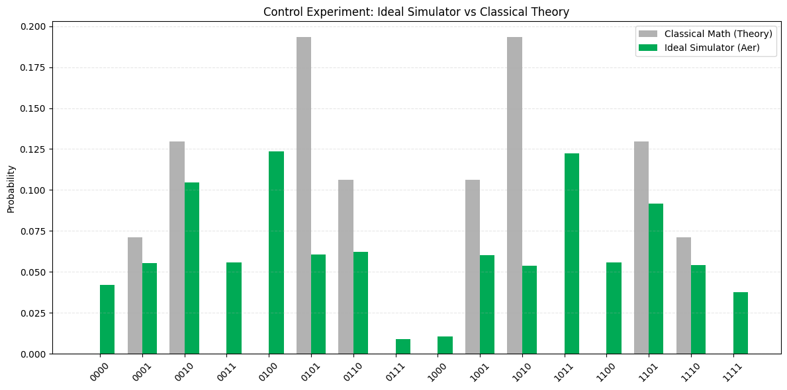
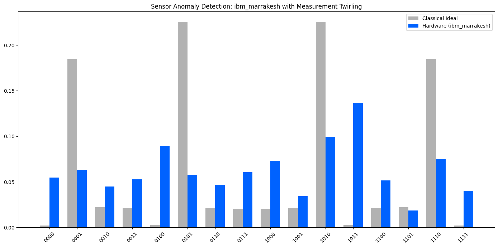

# Quantum-Assisted Sensor Consistency Analysis Using QAOA on NISQ Hardware

  

## 📌 Project Overview
This project investigates the viability of using the **Quantum Approximate Optimization Algorithm (QAOA)** to detect inconsistencies (anomalies) in distributed sensor networks. 

Using real-world environmental data from the **Intel Berkeley Research Lab dataset**, the problem is mapped to a graph partition Hamiltonian. The circuit is executed on the **IBM Quantum `ibm_marrakesh`** backend to benchmark the performance of current NISQ hardware against classical ideal simulations.

## 🚀 Key Features
* **Data:** Utilizes temperature logs from the Intel Berkeley sensor grid.
* **Qiskit Stack:** Implemented using **Qiskit Runtime V2 Primitives (`SamplerV2`)**.
* **Error Mitigation:** Applies **Measurement Twirling** to convert coherent readout errors into stochastic noise, improving the signal-to-noise ratio.
* **Benchmarking:** Comparative analysis between:
    * Ideal Classical Theory
    * Noiseless Simulation
    * Hardware Execution

## 📊 Results
*Detailed plots comparing the probability distributions of the sensor states.*

| Classical Ideal vs. Simulator | Hardware Execution (IBM Marrakesh) |
| :---: | :---: |
|  |  |
| *The simulator perfectly recovers the ground state representing the anomaly.* | *Hardware results showing noise effects despite error mitigation.* |

## 🛠️ Methodology
### 1. The Problem
We model the sensor network as a graph $G=(V, E)$ where nodes are sensors and edges represent spatial adjacency. The cost function is designed such that the "ground state" (lowest energy) corresponds to the configuration that highlights the anomalous sensor (Sensor 3).

### 2. The Hamiltonian
The cost Hamiltonian $H_C$ is constructed using Weighted Max-Cut logic, where weights $w_{ij}$ correspond to the difference in sensor readings:

$$H_C = \sum_{(i,j) \in E} w_{ij} Z_i Z_j$$

Where $w_{ij} \propto |T_i - T_j|$. Large temperature gradients create high weights, energetically penalizing alignment and identifying the outlier.

## 💻 Tech Stack
* **Python 3.10+**
* **Qiskit SDK 1.0+** & **Qiskit IBM Runtime**
* **Matplotlib** (Visualization)
* **NumPy** (Data processing)

## ⚠️ Usage Warning
This project requires access to IBM Quantum Hardware.
**Do not hardcode your API token.** Export it as an environment variable:
```bash
export QISKIT_IBM_TOKEN="your_token_here"
